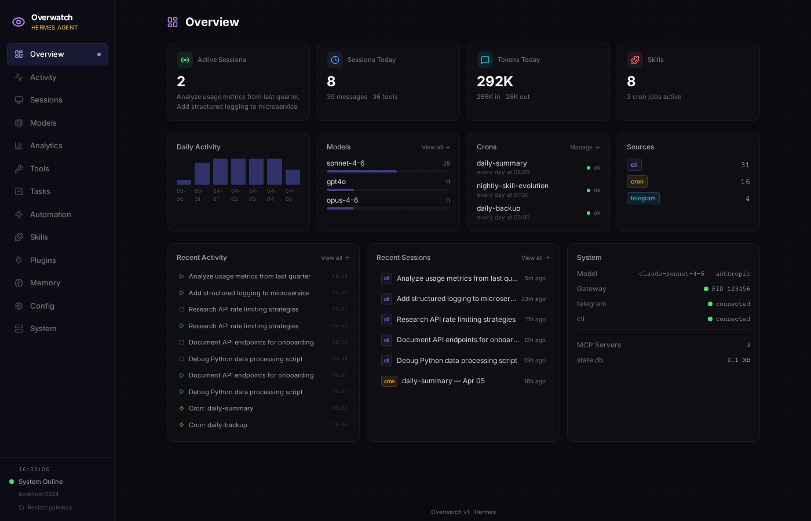
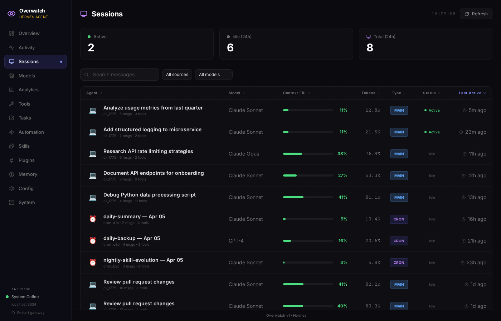
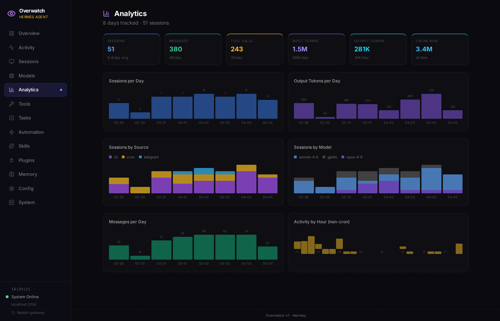
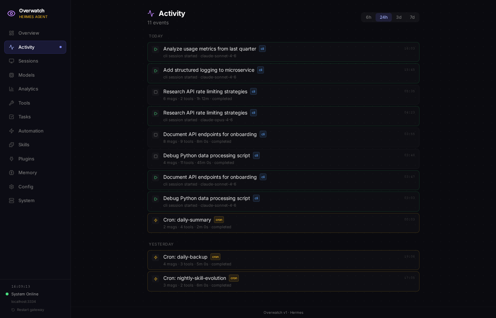

# 👁️ Overwatch

A local dashboard for [Hermes Agent](https://github.com/hermes-agent/hermes-agent).

It gives you one place to inspect sessions, analytics, tools, automation, memory, config, and system state from your local Hermes installation.

What it is:
- a read-only UI over Hermes data
- useful for seeing what Hermes has been doing
- meant to run locally, next to your agent data

What it is not:
- a hosted multi-user control plane
- a hardened internet-facing admin panel
- a replacement for Hermes itself

---

## Security Notes

Overwatch reads directly from your local Hermes home directory, which may contain session transcripts, memory, configuration, logs, cron metadata, and other sensitive operational data.

Before exposing Overwatch beyond localhost:
- set `OVERWATCH_PASSWORD`
- review the data visible in Memory, Config, and System pages
- verify screenshots and docs do not include hostnames, local paths, process IDs, session IDs, or token-like strings

Screenshots in this repo are generated from synthetic demo data (see `scripts/seed-demo.py`) — no real session history, keys, or personal data.

---

## Screenshots






---

## Features

- **Overview + analytics** — usage totals, activity patterns, models, and tool usage
- **Session browser** — search history and open full transcripts
- **Automation visibility** — inspect cron jobs, delegation, delivery targets, and recent outputs
- **Memory + skills** — browse agent memory, user profile, and installed skills
- **Config + system** — inspect redacted config, service health, logs, and machine status

---

## Quick Start

```bash
# Clone
git clone https://github.com/stephenschoettler/Hermes-Overwatch.git
cd Hermes-Overwatch

# Install
npm install

# Build
npm run build

# Start
npm start
```

Overwatch will be available at `http://localhost:3333`.

By default it reads from `~/.hermes`. Set `HERMES_HOME` if your Hermes installation lives somewhere else.

---

## Configuration

Copy `.env.example` to `.env.local` and customize:

```bash
cp .env.example .env.local
```

| Variable | Default | Description |
|---|---|---|
| `OVERWATCH_PASSWORD` | *(empty)* | Optional password. If set, requires login. If empty, open access. |
| `HERMES_HOME` | `~/.hermes` | Path to the Hermes home directory |

### Security

- **No password set** — open access, suitable only for localhost or a trusted private network
- **Password set** — cookie-based login, 30-day session, HttpOnly cookie
- **Secret redaction** — API keys, tokens, and credentials are automatically masked in the config viewer
- **Sensitive by design** — Memory, Config, System, and transcript views can expose private local agent data
- **Localhost only** — binds to `127.0.0.1` by default. Expose to your network only if you understand the risk.

---

## Development

```bash
npm run dev
```

Runs on port 3333 in dev mode with hot reload.

---

## Architecture

- **Next.js 14** (App Router) — frontend + API routes
- **Tailwind CSS** — dark theme UI
- **better-sqlite3** — direct read-only access to Hermes `state.db`
- **No external database** — everything comes from the local Hermes home directory

### Data Sources

| Source | What it provides |
|---|---|
| `state.db` | Sessions, messages, token counts, costs (SQLite + FTS5 search) |
| `cron/jobs.json` | Scheduled cron jobs |
| `config.yaml` | Agent configuration (redacted in UI) |
| `memories/` | Agent memory and user profile |
| `skills/` | Installed skill definitions |

Overwatch is **read-only** — it observes your Hermes installation, it does not modify it.

---

## Requirements

- **Node.js 18+**
- **Hermes Agent** installed (`~/.hermes` directory exists)

---

## License

MIT
